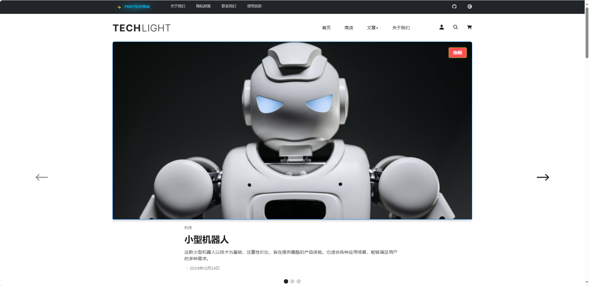
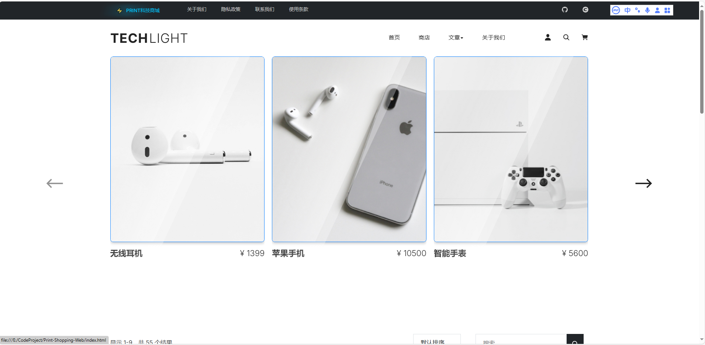
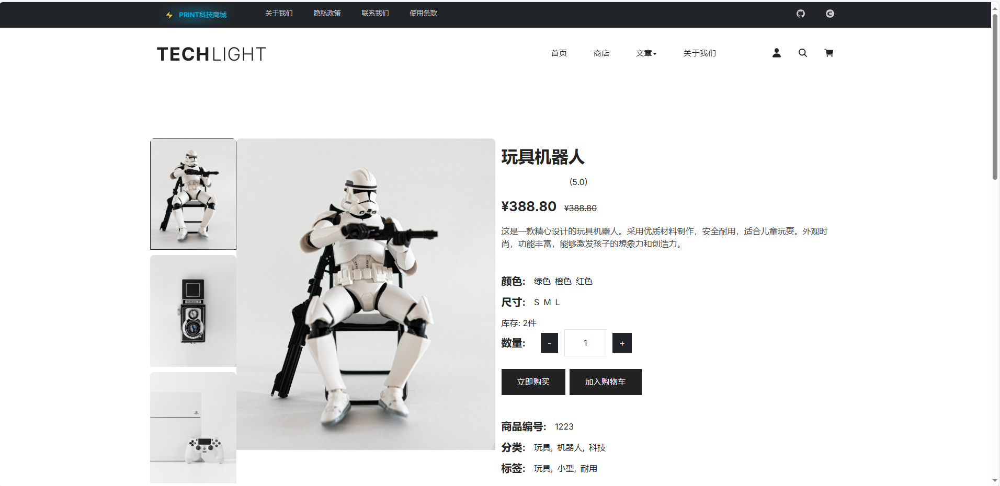

# 🚀 PRINT科技商城

一个充满未来科技感的电商网站，采用现代化设计和丰富的交互动效。

## ✨ 特色功能

- 🎯 炫酷的火箭返回顶部动画
- 💫 商品添加购物车抛物线动效
- ⚡ 科技感十足的UI设计
- 🌈 流畅的页面过渡效果
- 🎨 精美的加载动画
- 🔍 实时搜索功能
- 📱 完全响应式设计

## 🛠️ 技术栈

- HTML5
- CSS3 (动画、过渡效果)
- JavaScript (ES6+)
- jQuery
- Bootstrap 5

## 核心功能展示

### 1. 首页轮播图 

特点:
- 移动端优先设计
- 流式网格布局
- 弹性导航菜单
- 自适应图片尺寸

## 技术实现细节

### 1. 动画系统

所有动画效果都基于 CSS3 动画和 JavaScript 实现，主要包括:
- transform 变换
- opacity 透明度
- gradient 渐变
- transition 过渡

### 2. 性能优化

- 使用 requestAnimationFrame 实现平滑动画
- 延迟加载非首屏图片
- CSS 动画替代 JavaScript 动画
- 避免重排重绘

### 3. 兼容性处理

- 主流浏览器前缀
- Flexbox 降级方案
- 触摸事件支持
- 响应式图片处理

## 常见问题

1. 动画卡顿
- 检查浏览器性能
- 减少同时执行的动画数量
- 使用 transform 替代位置动画

2. 响应式布局问题
- 检查媒体查询断点
- 测试不同设备尺寸
- 确保图片正确缩放

## 后续优化计划

1. 性能优化
- [ ] 引入虚拟滚动
- [ ] 优化图片加载
- [ ] 减少主线程阻塞

2. 功能增强
- [ ] 添加更多动画效果
- [ ] 优化移动端交互
- [ ] 增加用户反馈系统

## 贡献指南

欢迎提交 Issue 和 Pull Request，请确保：
1. 代码符合项目规范
2. 提供必要的测试用例
3. 更新相关文档